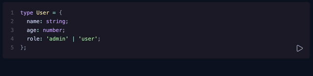
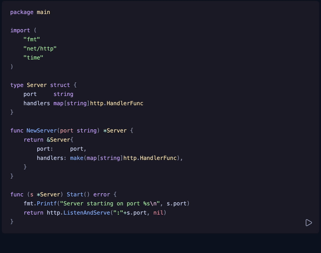

# shiki-magic-move Plugin For Expressive Code

A port of [shiki-magic-move](https://github.com/shikijs/shiki-magic-move) for Expressive Code.

## Examples




## Installation

```bash
npm install ec-magic-move
# pnpm install ec-magic-move
# bun install ec-magic-move
# yarn add ec-magic-move
```

## Usage

Add the plugin to your Expressive Code configuration:

```js
import { defineConfig } from 'astro/config';
import { pluginMagicMove } from 'ec-magic-move';

export default defineConfig({
  integrations: [
    starlight({
      expressiveCode: {
        plugins: [pluginMagicMove()],
      },
    }),
  ],
});
```

In the individual code blocks, add the following two line ranges (defined by a start and an end):

- `magic-move-before`
- `magic-move-after`

```md
```ts magic-move-before={1-12} magic-move-after={13-26}
```

> [!NOTE]
> If there are errors in the ranges (i.e. the start of the after block is smaller than the end of the start block), an error is displayed at the bottom of the codeblock.
> This way, the server doesn't crash due to misconfigurations.

## Configuration

The plugin accepts an optional configuration object:

```ts
pluginMagicMove({
 duration: 800, // the duration of the animation in milliseconds
 stagger: 3, // the stagger between the individual tokens, also in milliseconds
 lineNumbers: true, // whether or not to show line numbers
 theme: 'catppuccin-mocha', // the theme of the shiki highlighter
 buttonPosition: 'bottom-right', // the position of the play button
})
```

### Options

- `duration`: the duration of the animation in milliseconds (default: `800`)
- `stagger`:  the stagger between the individual tokens, also in milliseconds (default: `3`)
- `lineNumbers`: whether or not to show line numbers (default: `true`)
- `theme`: the theme of the shiki highlighter (default: `catppuccin-mocha`, possible values: all shiki themes)
- `buttonPosition`: the position of the play button (default: `bottom-right`, other possible values: `bottom-left`, `top-right`, `top-left`)

## Per-Block Customization

You can override settings for individual code blocks using meta attributes:

```md
```js magic-move-duration="400"
// Animation takes 400ms
```

```md
```js magic-move-stagger="5"
// Animation has a stagger of 5ms
```

```md
```ts magic-move-line-numbers="false"
// No line numbers on this block
```

### Available Meta Attributes

- `magic-move-duration="value"`: Override the animation duration for this block
- `magic-move-stagger="value"`: Override the animation stagger for this block
- `magic-move-line-numbers="boolean"`: Decide per block whether or not to show the line numbers
